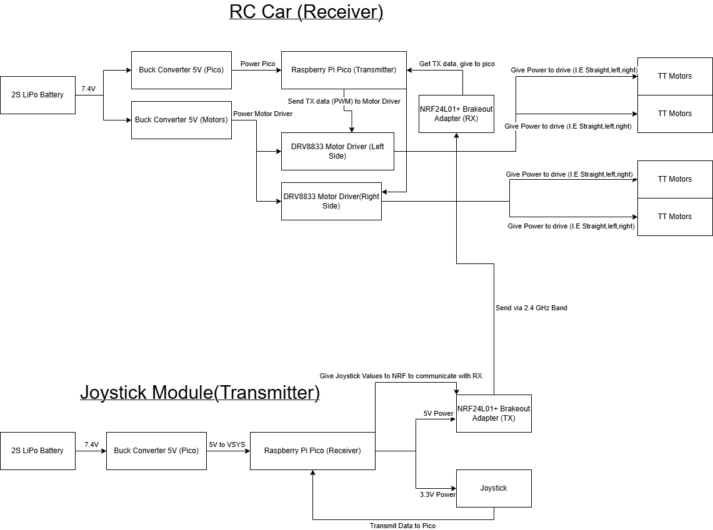

# RC Car with Wireless Joystick Control (In Progress)

This project will demonstrate a wirelessly controlled RC car using two Raspberry Pi Picos and 2.4GHz radio communication. The goal is to create a simple, modular, and lightweight car that receives commands from a remote joystick module and moves accordingly. While hardware assembly is still in progress, all components have been researched, and the system diagram has been drafted.

## Project Overview

The system is made up of two main units:

### 1. RC Car (Receiver Unit)
The receiver side will be mounted onto the chassis of the RC car. It will include:
- A Raspberry Pi Pico to interpret joystick data
- An nRF24L01+ breakout module to receive data via 2.4GHz
- Two DRV8833 motor drivers to independently control the left and right side wheels
- Four TT gear motors for movement
- Two 5V buck converters to step down from a 2S LiPo (7.4V) battery:
  - One for powering the Pico
  - One for powering the motor drivers

### 2. Joystick Module (Transmitter Unit)
The joystick module will be held separately by the user. It will include:
- A second Raspberry Pi Pico to read analog values from the joystick
- An nRF24L01+ breakout module to transmit the joystick data wirelessly
- A joystick module with X/Y axes and a button
- A dedicated 2S Lipo battery stepped down to 5V using a buck converter

Joystick input will be read by the transmitter Pico, sent over the air using the nRF24L01+ module, and received by the Pico on the car. Based on the values received, the car’s Pico will generate PWM signals to the DRV8833 drivers to spin the motors in the correct direction and speed.

## System Diagram

The following diagram outlines the full system, including power flow, communication links, and signal directions:

## Status

Parts have been ordered and are being prepared for initial prototyping. This repository will be updated with wiring details, code, and testing results once assembly begins.

## Goals

- Demonstrate system-level thinking in embedded design
- Build an RC car using simple, low-cost components
- Apply SPI communication and PWM control in a wireless system
- Use clean modular code structure for both transmitter and receiver

